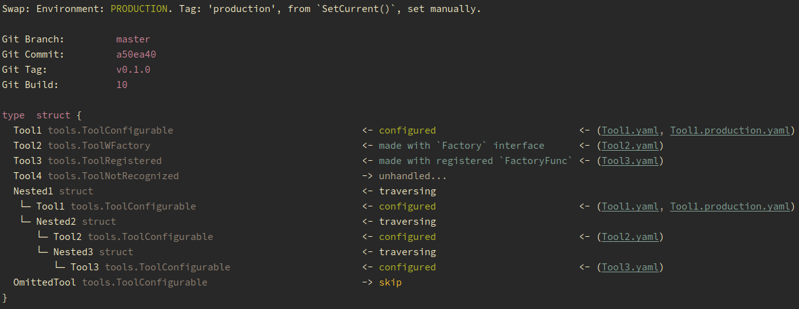

# Swap

[](https://github.com/avelino/awesome-go)

[](https://travis-ci.org/oblq/swap)

[](https://goreportcard.com/report/github.com/oblq/swap)
[](https://pkg.go.dev/github.com/oblq/swap?tab=doc)
[](https://lbesson.mit-license.org/)

Dynamically instantiate and configure structs and/or parse config files in to them recursively, based on your build environment.  
Keep your projects and their configuration files ordered and maintainable while boosting your productivity.

**Swap** package is based on three different tools:

- The **Builder** which recursively builds/configures structs with the help of some abstract Factory methods, and the two other tools below.
- An **EnvironmentHandler** which always determine the current environment, needed to determine which configurations to use. Can be used indipendently.
- An agnostic, layered, **ConfigParser** (YAML, JSON, TOML and Env) which can also be used in conjunction with the EnvironmentHandler and/or indipendently.  

## Installation

```go
import "github.com/oblq/swap"
```

## Quick start

Given that project structure:

```txt
├── config
│   ├── Tool1.yaml
│   ├── Tool1.production.yaml
│   ├── Tool2.yaml
│   ├── Tool3.yaml
│   └── Tool4.yaml
└── main.go
```

...we can load a struct configuring any of its fields with the right config file for the current build environment:

```go
// main.go

import (
    "reflect"

    "github.com/oblq/swap"
)

// shared singleton
var ToolBox struct {
    // By default, swap will look for a file named like the
    // struct field name (Tool1.*, case-sensitive).
    // Optionally pass one or more config file name in the tag,
    // they will be added to the config files passed in factory methods.
    // The file extension can be omitted.
    Tool1 tools.ToolConfigurable
    Tool2 tools.ToolWFactory `swap:"Tool3|Tool4"`
    Tool3 tools.ToolRegistered
    Tool4 tools.ToolNotRecognized

    Nested1 struct {
        Tool1   tools.ToolConfigurable
        Nested2 struct {
            Tool2   tools.ToolConfigurable
            Nested3 struct {
                Tool3 tools.ToolConfigurable
            }
        }
    }

    // Add the '-' value to skip the field.
    OmittedTool        tools.ToolConfigurable `swap:"-"`
}

func init() {
    // Get a new Builder instance for the given config path.
    builder := swap.NewBuilder("./config")

    // Register a `FactoryFunc` for the `tools.ToolRegistered` type.
    builder.RegisterType(reflect.TypeOf(tools.ToolRegistered{}),
        func(configFiles ...string) (i interface{}, err error) {
            instance := &tools.Tool{}
            err = swap.Parse(&instance, configFiles...)
            return instance, err
        })

    // Force the current build environment manually to `production`.
    // This way the production config files, if exist, will be
    // passed to the constructor/configurator func along with the 
    // default one, but later, so that it will override previously passed parameters.
    builder.EnvHandler.SetCurrent("production")

    // Build the ToolBox
    if err := builder.Build(&ToolBox); err != nil {
        panic(err)
    }
}
```

And this is the result in console:



### Builder

The builder is kind of Director pattern implementation which recursively builds and/or configures every field of the given struct.  
It must be initialized with the path containing the configurations files, and can optionally use a custom `EnvironmentHandler`:

```go
// Get a new Builder instance for the given config path.
builder := swap.NewBuilder("./config")

// Optionally set a custom EnvironmentHandler.
envHandler := swap.NewEnvironmentHandler(swap.DefaultEnvs.Slice())
builder = builder.WithCustomEnvHandler(envHandler)

```

A struct field can be 'made' or 'configured' automatically by the builder if:

- Implement the `swap.Factory` interface:

    ```go
    // Factory is the abstract factory interface.
    type Factory interface {
        New(configFiles ...string) (interface{}, error)
    }
  
    // so:
    func (t *Tool) New(configFiles ...string) (i interface{}, err error) {
        instance := &Tool{}
        err = swap.Parse(&instance, configFiles...)
        return instance, err
    }
    ```

- Implement the `swap.Configurable` interface:

    ```go
    // Configurable interface allow the configuration of fields
    // which are automatically initialized to their zero value.
    type Configurable interface {
        Configure(configFiles ...string) error
    }
  
    // so:
    func (t *Tool) Configure(configFiles ...string) (err error) {
        return swap.Parse(t, configFiles...)
    }
    ```

- A `swap.FactoryFunc` has been registerd for that specific field type.

    ```go
    // Register a `FactoryFunc` for `Tool` type.
    builder.RegisterType(reflect.TypeOf(Tool{}),
        func(configFiles ...string) (i interface{}, err error) {
            instance := &Tool{}
            err = swap.Parse(&instance, configFiles...)
            return instance, err
        })
    }
    ```

In any of these cases the config files passed already contains environment specific ones (`config.<environment>.*`) if they exist.

The builder interpret its specific struct field tag:

- ``` `swap:"<a_config_file_to_add>|<another_one>"` ``` Provides additional config files, they will be parsed in the same order and after the generic file (the one with the name of the struct field) if found, and also after the environment specific files.  

- ``` `swap:"-"` ``` Skip this field.

### EnvironmentHandler

The EnvironmentHandler is initialized with a list of environments (`[]*Environment`) and the current one is determined matching a ***tag*** against its specific RegExp.  

The five standard build environments are provided for convenience, and if you use git-flow they're ready:

```go
// Default environment's configurations.
var DefaultEnvs = defaultEnvs{
    Production:  NewEnvironment("production", `(production)|(master)|(^v(0|[1-9]+)(\\.(0|[1-9]+)+)?(\\.(\\*|(0|[1-9]+)+))?$)`),
    Staging:     NewEnvironment("staging", `(staging)|(release/*)|(hotfix/*)|(bugfix/*)`),
    Testing:     NewEnvironment("testing", `(testing)|(test)`),
    Development: NewEnvironment("development", `(development)|(develop)|(dev)|(feature/*)`),
    Local:       NewEnvironment("local", `local`),
}
```

Provide your custom environments otherwise, the primary tag should be matched by the regexp itself:

```go
myCustomEnv := swap.NewEnvironment("server1", `(server1)|(server1.*)`)
```

There are different ways to set the tag which will determine the current environment, `EnvironmentHandler` will try to grab that tag in three different ways, in that precise order, if one can't be determined it will fallback to the next one:

1. The manually set tag:

    ```go
    envHandlerInstance.SetCurrent("development")
    envHandlerInstance.SetCurrent("server1")
    ```

2. The system environment variable (`BUILD_ENV` by default, can be changed):

    ```go
    envHandlerInstance.Sources.SystemEnvironmentTagKey = "DATACENTER"
    ```

3. The Git branch name, by default the working dir is used, you can pass a different git repository path:  

    ```go
    envHandlerInstance.Sources.Git = swap.NewRepository("path/to/repo")
    ```  

When running tests the environment will be set automatically to 'testing' if not set manually and git has not been initialized in the project root.
  
Finally you can check the current env in code:

```go
myCustomEnv := swap.NewEnvironment("server1", `(server1)|(server1.*)`)
envs := append(swap.DefaultEnvs.Slice(), myCustomEnv)

envHandler := NewEnvironmentHandler(envs)
envHandler.SetCurrent(myCustomEnv.Tag())

if envHandler.Current() == myCustomEnv {
    println("YES")
}
```

### ConfigParser (agnostic, layered, configs unmarshalling)

**Swap** implement two config parser funcs:

- `swap.Parse()`
- `swap.ParseByEnv()`

Both uses three specific struct field tags:

- ``` `swapcp:"default=<default_value>"` ``` Provides a default value that will be used if not provided by the parsed config file.  

- ``` `swapcp:"env=<system_environment_var_name>"` ``` Will grab the value from the env var, if exist, overriding both config file provided values and/or default values.

- ``` `swapcp:"required"` ``` Will return error if no value is provided for this field.

Supposing we have these two yaml files in a path 'config':  
pg.yaml

```yaml
port: 2222
```

pg.production.yaml

```yaml
port: 2345
```

...to unmarshal that config files to a struct you just need to call `swap.Parse()`:

```go
var PostgresConfig struct {
    // Environment vars overrides both default values and config file provided values.
    DB       string `swapcp:"env=POSTGRES_DB,default=postgres"`
    User     string `swapcp:"env=POSTGRES_USER,default=default_user"`
    // If no value is found that will return an error: 'required'.
    Password string `swapcp:"env=POSTGRES_PASSWORD,required"`
    Port     int    `swapcp:"default=5432"`
}

_ = os.Setenv("POSTGRES_PASSWORD", "my_secret_pass")

if err := swap.Parse(&PostgresConfig, "config/pg.yaml"); err != nil {
    fmt.Println(err)
}

fmt.Printf("%#v\n", PostgresConfig) 
// Config{
//      DB:         "postgres"
//      User:       "default_user"
//      Password:   "my_secret_pass"
//      Port:       2222
// }

if err := swap.ParseByEnv(&PostgresConfig, swap.DefaultEnvs.Production, "config/pg.yaml"); err != nil {
    fmt.Println(err)
}

fmt.Printf("%#v\n", PostgresConfig) 
// Config{
//      DB:         "postgres"
//      User:       "default_user"
//      Password:   "my_secret_pass"
//      Port:       2345
// }
```

`Parse()` strictly parse the passed files while `ParseByEnv()` look for environment specific files and will parse them to the interface pointer after the default config.

Depending on the passed [environment](#EnvironmentHandler), trying to load `config/pg.yml` will also load `config/pg.<environment>.yml` (eg.: `cfg.production.yml`).  
If any environment-specific file will be found, for the current environment, that will override the generic one.  

A file is found for a specific environment when it has that env **Tag** in the name before the extension (eg.: `config.production.yml` for the production environment).  

It is possible to load multiple separated config files, also of different type, so components configs can be reused:

```go
swap.Parse(&pusherConfig, "config/pusher.yml", "config/postgres.json")
```

Be aware that:

1. YAML files uses lowercased keys by default, unless you define a yaml field tag with a custom name the struct field `Postgres` will become `"postgres"`, while in TOML or JSON it will remain `"Postgres"`.
2. The default map interface is `map[interface{}]interface{}` in YAML, not `map[string]interface{}` as in JSON or TOML and this can produce some errors if the two types are parsed together to the same struct.

Also, both `Parse()` and `ParseByEnv()` will parse `text/template` placeholders in config files, the key used in placeholders must match the key of the config interface:

```go
type Config struct {
    Base string
    URL string
}
```

```yaml
base: "https://example.com"
url: "{{.Base}}/api/v1" # -> will be parsed to: "https://example.com/api/v1"
```

## Examples

- [example](example)

To start it run:

```sh
make example
```

## Vendored packages

- [`gopkg.in/yaml.v3`](https://github.com/go-yaml/yaml)  
- [`github.com/BurntSushi/toml`](https://github.com/BurntSushi/toml)

## License

Swap is available under the MIT license. See the [LICENSE](./LICENSE) file for more information.
